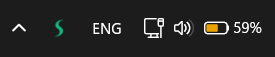
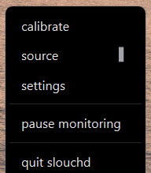
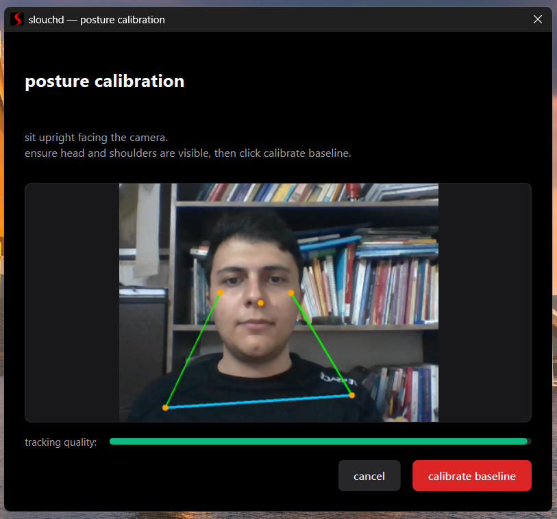
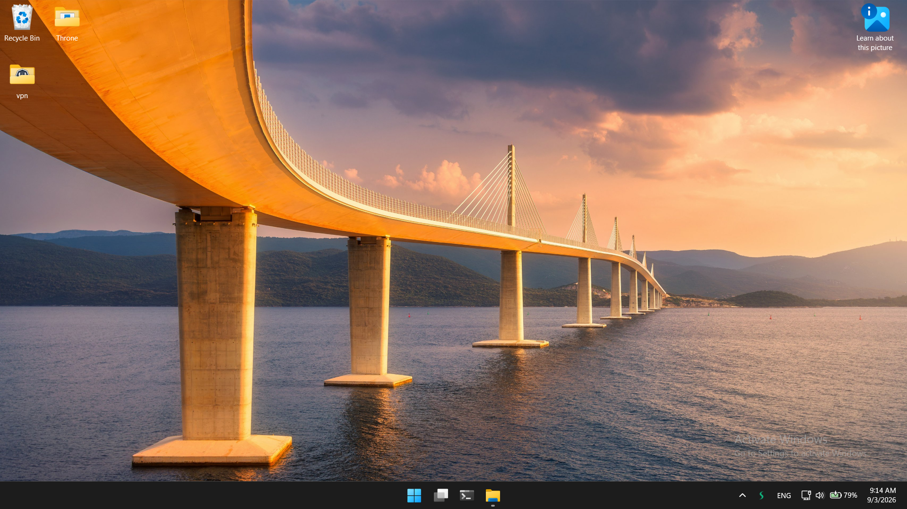
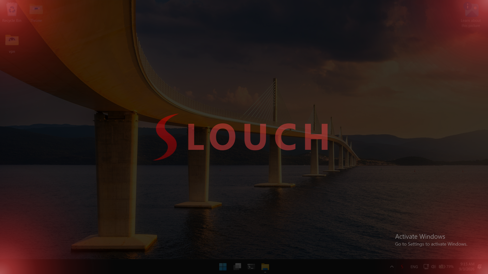
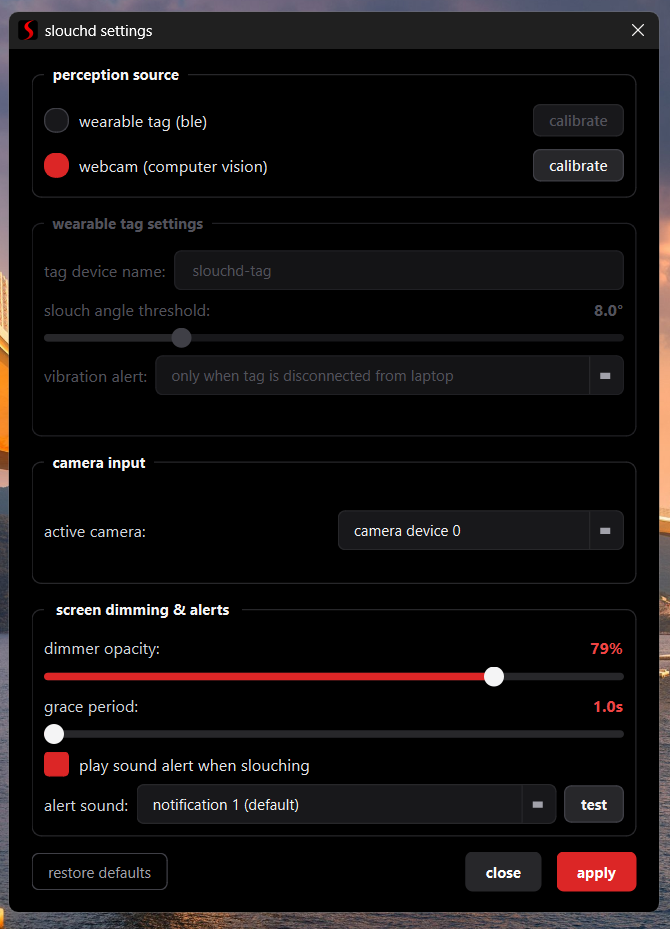

## intro
slouchd is a posture monitoring toolchain that currently has a desktop application and an opensource wearable hardware that we call "slouchd-tag". the purpose of this project is to build an alerting system that can detect when you slouch or loose your proper posture so it can warn you immediately. this immediate warning will be very helpful for those who have a habit of slouching when they are busy doing sth and they are unaware of their bad posture untill it really hearts and thats obviously too late for correcting it.

for achiving this im currently focussing on two main sub-projects:

**slouchd-desktop** and **slouchd-tag**:
the desktop app is just a software or i rather call it a deamon that can watch you via your webcam in a totally offline environment (in case if you care about your privacy). my focus in developing it was on low cpu and ram usage because its going to be working in the background all the time and as of now that i've been checking it on my low-end windows machine, its using less than 1% of my cpu constantly which is negligble (its even more efficient in cpu and ram usage on linux machines as i tested on fedora 44 workstation and it was like using less than 0.5% cpu constantly). and all these tests that i had was totally running on cpu and the machine did not have a dedicated gpu which is a good thing thanks to light-weight [google's mediapipe models](https://github.com/google-ai-edge/mediapipe).

but there are people out there who don't want their webcam to be working all the time (note that again that our software is totally offline and also **opensource** so you can investigate it yourself and i appreciate it) or even they might have no webcam or proper drivers for it on their desired operating system, but they deserve a good posture too. if this sounds like you, then if you don't mind assembling and tinkering with some hardware, i prepared an esp32 based wearbale so you can build it yourself with the specifications provided in this project and then you flash our firmware onto it and start using it seamlessly instead of a webcam. good news that this method is gonna be even lighter on your cpu and ram, and also it can keep you alert about your posture in standalone mode (when you are not using your desktop and our software and you are out for a walk, via haptic vibrations). 

## installation
you can grab the prebuilt installer directly from the releases page so you can install it with a click and use it out of the box:

👉 [**download latest installer**](https://github.com/JavadJam01/slouchd/releases/latest) (or check [all releases](https://github.com/JavadJam01/slouchd/releases))

just download the installer for your system, run it, and you're good to go.

**note for windows users:** when downloading, your browser (especially microsoft edge) might try to discard or block the download, or windows smartscreen might show an unrecognized app warning during installation. dont worry, this is completely normal for fresh releases without an expensive code-signing certificate. our software is 100% opensource and safe (you can review all the code here yourself). we also scanned the installer on virustotal and it has a completely clean score of **0/68** (link to the virustotal report is always available at [latest release notes](https://github.com/JavadJam01/slouchd/releases/latest). this warning is temporary untill we submit the binary to microsoft to get it whitelisted. for now, you can just click "keep" (or "keep anyway") in your browser, and on windows smartscreen click "more info" -> "run anyway".

## usage
now lets talk about the usage:

when you run the desktop app, it will create a tray icon that you can interact with it (if you are on windows you may have to click on "show hidden icons" button in you taskbar to see that and if you want that to be visible on your main taskbar visit this **page** or if you are on gnome you may need to install a proper extension for tray icons such as [this](https://extensions.gnome.org/extension/615/appindicator-support/) )

now by rightclicking on it you can access to some options:

**important:** first thing you need to do is to **calibrate** your baseline posture.

from now on when you slouch or lean improperly for an extended period (you can set your desired grace period and also the slouch threshold in the settings), it smoothly dims your display(s) and alerts you to maintain a healthy posture.

**before**

**after**

**important :** feel free to explore and tweak the settings so you can get the best custom experience for you. i tried to make them as intuitive as possible. and also theres an option for restoring the default settings.

**wearable tag usage:** as you see theres an option to choose the perception source, so as we promised earlier if you prefer not to use a webcam for any reason, you can build our opensource hardware yourself and then use the app easily, furthermore you can also use the hardware in standalone mode.

this is the prototype that i made (i'm still working on the 3D case design but i guess the perfboard itself is good for a prototype):

we are using below hardware:

- esp32 c3 supermini
- InvenSense icm-42670p IMU (6-axis)
- 3.7v 1s LiPo (600mah)
- tp4056 (although i replaced its programming resistor (r3) with a 3.9k resistor to reduce charging current from 1A to ~308 mA for increasing the battery lifespan)
- 100k/100k voltage devider for battery sensing
- coin vibration motor

exact wiring info in [this file](</slouchd-tag/README.md>)

## slouchd-tag usage

after you turn it on, you hear a buzz which is the sign for bootup's calibration start (although it'll wait for you to stay still then starts to calibrate, but its better to turn the device on when its clipped to your collar and you're sitting upright) then after aprox 2sec you hear a double buzz again which means that its calibrated. now you can use it in 2 ways, while you are not using your laptop and its disconnected, you'll sense a buzz when you slouch (you can customize the angle treshold using the app), furthermore you can connect it to the app using ble (which is highly optimized for low battery usage both the ble itslef and our firmware). below are the instructions to do so:

**note:** in addition to bootup calibration you can also use the desktop app for calibrating the baseline again as below:

- make sure the app is open and also your laptop bluetooth adapter is on. then open the settings and simply toggle the tag as the perception source. (you can also do this via the tray menu).

or via tray menu:

- after selection wait for the app to find and connect to the tag

 

- **note** that if you previously changed your tag name, type that or some prefix of that in "tag device name" so the app can find it. (if you write a new name and apply it while the tag is connected, the wearbale tag will be renamed.) also note that other tag settings are grayed out untill you connect the device.

- now you should connect: 

- **note** that the default setting is to disable the vibration buzz while its connected to the app and just rely on screen dimming overlay and sound alerts on the desktop (to save batery life). but you can customize this behavior as well as threshold if you want:

## important note !
- **note** that by default i set the grace period (the period that the system waits in case of slouching before warning you) to **1 sec** cause i like it to be strict with me but it may exhaust you so you can change it as below: (although i tried very hard to develop the system as smart as possible so it can recognize false positives, and currently in my experience the false positives are less than 5% and negligible if you calibrate it correctly, with increasing the grace period to 2 sec i can guarantee you there will be no false positives in normal env). 

- also the sound alert might not be a good idea in some places so also you can toggle it on/off based on your situation, moreover you can change the default sound if its not your taste.

**note:** these sound tracks are royalty free but some of them required attribution that i mentioned in the [**ATTRIBUTIONS.md**](</slouchd-desktop/assets/sounds/ATTRIBUTIONS.md>) (I really don't know if those windows xp cloned soundtracks are legal to use here, if you know i would appreciate if you open an issue)

-- more info about [slouchd-desktop](</slouchd-desktop/README.md>)

-- more info about [slouchd-tag](</slouchd-tag/README.md>)

-- you can find hardware docs/datasheets and 3d designs in [here](/slouchd-tag/firmware/)
